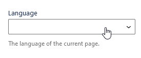
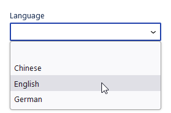
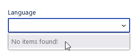
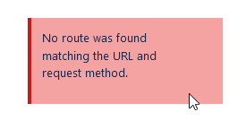

# FetchAllTermSelectControl

The `FetchAllTermSelectControl` component allows for choosing one of a reasonably small number of terms in a given taxonomy.
It is intended to be used with taxonomies that only have a few (e.g., around 20) terms to pick from.
The component does not allow for searching, but instead wraps a simple [`SelectControl`](https://github.com/WordPress/gutenberg/blob/trunk/packages/components/src/select-control/index.tsx) component.

|  |
|---|
| _`FetchAllTermSelectControl` component._ |

|  |
|---|
| _`FetchAllTermSelectControl` component displaying found terms to select from._ |

|  |
|---|
| _`FetchAllTermSelectControl` component indicating that no terms were found._ |

|  |
|---|
| _`FetchAllTermSelectControl` component displaying an inline error notice._ |

## Usage

For a minimum working setup, all you need to do is pass a `taxonomy` slug and a term ID as `value` to `FetchAllTermSelectControl`, as well as an `onChange` callback that accepts a term ID.

```js
import { FetchAllTermSelectControl } from '@humanmade/block-editor-components';
import { PanelBody } from '@wordpress/components';
import { useDispatch, useSelect } from '@wordpress/data';
import { PluginSidebar } from '@wordpress/edit-post';

function Plugin() {
	const { editPost } = useDispatch( 'core/editor' );

	const term = useSelect(
		( select ) => select( 'core/editor' ).getEditedPostAttribute( 'category' )?.[0],
		[]
	);

	return (
		<PluginSidebar name={ sidebarName } title={ sidebarTitle }>
			<PanelBody>
				<FetchAllTermSelectControl
					taxonomy="category"
					value={ term }
					onChange={ ( term ) => editPost( { category: term } ) }
				/>
			</PanelBody>
		</PluginSidebar>
	);
}
```

Additionally, you can pass a `defaultOption` or a `fallbackOption`, or both.
The former will be displayed as first, selected option, if there are any terms to choose from; the default is an empty string with no value for the `<option>`.
The latter will be displayed if no terms were found, and is, by default, disabled; the default is "No terms found!", again, with no value.
If you pass `undefined` to `defaultOption`, the first actual term option will be selected by default.
If you pass `undefined` to `fallbackOption`, the nested `<SelectControl>` will not render at all in case there are no terms.

```js
import { FetchAllTermSelectControl } from '@humanmade/block-editor-components';
import { PanelBody } from '@wordpress/components';
import { useDispatch, useSelect } from '@wordpress/data';
import { PluginSidebar } from '@wordpress/edit-post';

function Plugin() {
	const { editPost } = useDispatch( 'core/editor' );

	const term = useSelect(
		( select ) => select( 'core/editor' ).getEditedPostAttribute( 'category' )?.[0],
		[]
	);

	return (
		<PluginSidebar name={ sidebarName } title={ sidebarTitle }>
			<PanelBody>
				<FetchAllTermSelectControl
					defaultOption={ {
						label: '—Select Category—',
						value: '',
					} }
					fallbackOption={ {
						disabled: true,
						label: 'Nothing to select. :(',
						value: '',
					} }
					taxonomy="category"
					value={ term }
					onChange={ ( term ) => editPost( { category: term } ) }
				/>
			</PanelBody>
		</PluginSidebar>
	);
}
```

Besides using the `FetchAllTermSelectControl` component in a block or custom plugin panel, it also allows for replacing a default taxonomy panel.
This is useful if you want to realize a single-term taxonomy UI.

```js
import { FetchAllTermSelectControl } from '@humanmade/block-editor-components';
import { addFilter } from '@wordpress/hooks';

addFilter(
	'editor.PostTaxonomyType',
	'my-project/single-category-ui',
	( OriginalComponent ) => ( originalProps ) => {
		const { slug } = originalProps;

		const { editPost } = useDispatch( 'core/editor' );

		const term = useSelect(
			( select ) => select( 'core/editor' ).getEditedPostAttribute( 'category' )?.[0],
			[]
		);

		if ( slug !== 'category' ) {
			return <OriginalComponent {...originalProps} />;
		}

		return (
			<FetchAllTermSelectControl
				taxonomy="category"
				value={ term }
				onChange={ ( term ) => editPost( { category: term } ) }
			/>
		);
	}
);
```

## Props

The `FetchAllTermSelectControl` component does not have any custom props other than `defaultOption`, `fallbackOption` and `taxonomy`, but you can pass anything that is supported by the nested [`SelectControl`](https://github.com/WordPress/gutenberg/blob/trunk/packages/components/src/select-control/index.tsx) component.

### `defaultOption`

An optional option to display as the first, selected one, if there are terms to pick from.
As this value is being used as one of the option items passed as `options` to `SelectControl`, it is expected to have both a string `label` and string `value` property, and it can also have a Boolean `disabled` property.
Passing `undefined` as `defaultOption` will automatically select the first actual term option.

| Type             | Required        | Default                                                                       |
|------------------|-----------------|-------------------------------------------------------------------------------|
| `?object`        | no              | <pre>{<br>    label: '',<br>    value: '',<br>}</pre> |

### `fallbackOption`

An optional option to display if there are no terms to pick from (but no error).
As this value is being used as one of the option items passed as `options` to `SelectControl`, it is expected to have both a string `label` and string `value` property, and it can also have a Boolean `disabled` property.
Passing `undefined` as `fallbackOption` will not display the `SelectControl` component if there are no terms to choose from.

| Type      | Required | Default                                                                                     |
|-----------|----------|---------------------------------------------------------------------------------------------|
| `?object` | no       | <pre>{<br>    disabled: true,<br>    label: 'No items found!',<br>    value: '',<br>}</pre> |

### `taxonomy`

The taxonomy slug.

| Type                                 | Required                             | Default                              |
|--------------------------------------|--------------------------------------|--------------------------------------|
| `string`                             | yes                                  | `undefined`                          |

## Dependencies

The `FetchAllTermSelectControl` component requires the following dependencies, which are expected to be available:

- `@wordpress/api-fetch`
- `@wordpress/components`
- `@wordpress/data`
- `@wordpress/i18n`
- `@wordpress/url`
