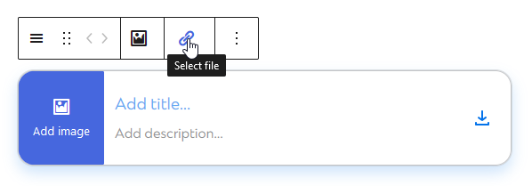
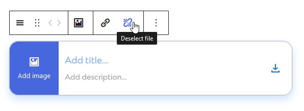

# FileControls

The `FileControls` component allows for selecting a resource from the media library.
Depending on a file having been selected, it will render a toolbar group with one or two buttons inside.
This means that the component is intended to be used inside [`BlockControls`](https://github.com/WordPress/gutenberg/blob/trunk/packages/block-editor/src/components/block-controls/index.js).

|  |
|:---:|
| _`FileControls` component._ |

|  |
|:---:|
| _`FileControls` component showing Deselect button._ |

## Usage

For a minimum working setup, all you need to do is pass a media ID as `value` to `FileControls`, as well as an `onChange` callback that accepts a media object.

```js
import { FileControls } from '@humanmade/block-editor-components';
import { BlockControls } from '@wordpress/block-editor';

function BlockEdit( props ) {
	const { attributes, setAttributes } = props;
	const { file } = attributes;

	return (
		<BlockControls>
			<FileControls
				value={ file }
				onChange={ ( file ) => setAttributes( { file: file?.id, url: file?.url } ) }
			/>
		</BlockControls>
	);
}
```

Additionally, you can pass anything as props that the nested [`MediaUpload`](https://github.com/WordPress/gutenberg/tree/trunk/packages/block-editor/src/components/media-upload/index.js) component accepts, except for `multiple` and `render`, which will be taken care of by `FileControls`.

```js
import { FileControls } from '@humanmade/block-editor-components';
import { BlockControls } from '@wordpress/block-editor';

function BlockEdit( props ) {
	const { attributes, setAttributes } = props;
	const { file } = attributes;

	return (
		<BlockControls>
			<FileControls
				alowedTypes={ [ 'image' ] }
				title="Select or Upload Image"
				value={ file }
				onChange={ ( file ) => setAttributes( { file: file?.id, url: file?.url } ) }
			/>
		</BlockControls>
	);
}
```

Please note that the `FileControls` component returns `null` if a previously selected file has been deselected.

## Props

The `FileControls` component does not have any custom props other than `value` and `onChange`, but you can pass anything that is supported by the nested [`RichText`](https://github.com/WordPress/gutenberg/blob/trunk/packages/block-editor/src/components/rich-text/index.js) component.

### `onChange`

The callback to use for handling selecting and deselecting a file.
Please note that `onChange` will receive a full media object from `MediaUpload`, and `null` if a previously selected file has been deselected.

| Type                                 | Required                             | Default                              |
|--------------------------------------|--------------------------------------|--------------------------------------|
| `Function`                           | yes                                  | `undefined`                          |

### `value`

The ID of the selected file, if any.

| Type                                 | Required                             | Default                              |
|--------------------------------------|--------------------------------------|--------------------------------------|
| `number`                             | yes                                  | `undefined`                          |
