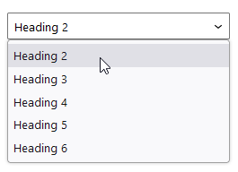
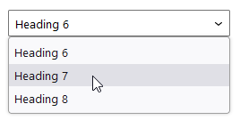

# HeadingSelectControl

The `HeadingSelectControl` component allows for choosing one of a pre-defined list of heading levels.
It is intended to be used for blocks or plugin sidebars where some text element needs to be rendered as a user-defined heading.
The component wraps a regular [`SelectControl`](https://github.com/WordPress/gutenberg/blob/trunk/packages/components/src/select-control/index.tsx) component.

|  |
|----------------------------------------------------------------------------------------------------|
| _`HeadingSelectControl` component._                                                                |

|  |
|--------------------------------------------------------------------------------------------------|
| _`HeadingSelectControl` component with custom `min` and `max` value specified._                  |

## Usage

For a minimum working setup, all you need to do is pass a heading level as `value` to `HeadingSelectControl`, as well as an `onChange` callback that accepts a heading level.

```js
import { HeadingSelectControl } from '@humanmade/block-editor-components';
import { InspectorControls } from '@wordpress/block-editor';

function BlockEdit( props ) {
	const { attributes, setAttributes } = props;
	const { deckLevel } = attributes;

	return (
		<InspectorControls>
			<HeadingSelectControl
				value={ deckLevel }
				onChange={ ( deckLevel ) => setAttributes( { deckLevel } ) }
			/>
		</InspectorControls>
	);
}
```

Additionally, you can also specify a minimum and/or maximum heading level by passing `min` and `max`, respectively.
For accessibility reasons, the default minimum heading level is set to `2`, so if you want to allow for selecting a Heading 1, you have to explicitly pass `min={ 1 }`.

```js
import { HeadingSelectControl } from '@humanmade/block-editor-components';
import { InspectorControls } from '@wordpress/block-editor';

function BlockEdit( props ) {
	const { attributes, setAttributes } = props;
	const { deckLevel } = attributes;

	return (
		<InspectorControls>
			<HeadingSelectControl
				min={ 1 }
				value={ deckLevel }
				onChange={ ( deckLevel ) => setAttributes( { deckLevel } ) }
			/>
		</InspectorControls>
	);
}
```

Since the component only allows for selecting a heading level, but does not actually render any heading element, you can also allow for something like a Heading 7 or Heading 8, if you really need to.
The HTML specification includes dedicated tags for 6 headings only, but sometimes editorial teams use special fake or pseudo headings, which will then end up in them having more than just 6 heading levels.
By passing a number greater than 6 to `max`, you can allow for that, and then handle rendering a Heading 7 or so, for example, as a paragraph with a custom class.

```js
import { HeadingSelectControl } from '@humanmade/block-editor-components';
import { InspectorControls } from '@wordpress/block-editor';

function BlockEdit( props ) {
	const { attributes, setAttributes } = props;
	const { level } = attributes;

	return (
		<InspectorControls>
			<HeadingSelectControl
				max={ 8 }
				min={ 6 }
				value={ level }
				onChange={ ( level ) => setAttributes( { level } ) }
			/>
		</InspectorControls>
	);
}
```

## Props

The `HeadingSelectControl` component does not have any custom props other than the optional `max` and `min`, but you can pass anything that is supported by the nested [`SelectControl`](https://github.com/WordPress/gutenberg/blob/trunk/packages/components/src/select-control/index.tsx) component.

### `max`

An optional maximum heading level.

| Type                                 | Required                             | Default                              |
|--------------------------------------|--------------------------------------|--------------------------------------|
| `number`                             | no                                   | `6`                                  |

### `min`

An optional minimum heading level.
This value is also being used as default value.

| Type                                 | Required                             | Default                              |
|--------------------------------------|--------------------------------------|--------------------------------------|
| `number`                             | no                                   | `2`                                  |

## Dependencies

The `HeadingSelectControl` component requires the following dependencies, which are expected to be available:

- `@wordpress/components`
- `@wordpress/i18n`
