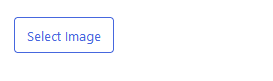

# ImageControl

The `ImageControl` component allows for selecting a single image from the Media Library in a sidebar panel.
Internally, `ImageControl` is wrapping a [`MediaUpload`](https://github.com/WordPress/gutenberg/tree/trunk/packages/block-editor/src/components/media-upload/index.js) inside a [`BaseControl`](https://github.com/WordPress/gutenberg/blob/trunk/packages/components/src/base-control/index.tsx) component.

|  |
|------------------------------------------------------------------------------------|
| _`ImageControl` component._                                                        |

|  |
|------------------------------------------------------------------------------------|
| _`ImageControl` component displaying the selected image._                          |

## Usage

For a minimum working setup, all you need to do is pass an image URL as `value`, as well as an `onChange` callback that accepts an image object.

```js
import { ImageControl } from '@humanmade/block-editor-components';
import { InspectorControls } from '@wordpress/block-editor';
import { PanelBody } from '@wordpress/components';

function BlockEdit( props ) {
	const { attributes, setAttributes } = props;
	const { imageId } = attributes;

	return (
		<InspectorControls>
			<PanelBody>
				<ImageControl
					value={ imageId }
					onChange={ ( image ) => setAttributes( { imageId: image?.id } ) }
				/>
			</PanelBody>
		</InspectorControls>
	);
}
```

You can also customize button texts, as well as the modal title.

```js
import { ImageControl } from '@humanmade/block-editor-components';
import { InspectorControls } from '@wordpress/block-editor';
import { PanelBody } from '@wordpress/components';

function BlockEdit( props ) {
	const { attributes, setAttributes } = props;
	const { imageId } = attributes;

	return (
		<InspectorControls>
			<PanelBody>
				<ImageControl
					buttonText="Select Thumbnail"
					modalTitle="Select Thumbnail"
					removeButtonText="Remove thumbnail"
					replaceButtonText="Replace Thumbnail"
					value={ imageId }
					onChange={ ( image ) => setAttributes( { imageId: image?.id } ) }
				/>
			</PanelBody>
		</InspectorControls>
	);
}
```

Also, all stable props of `BaseControl` are supported.

## Props

The `ImageControl` component has custom props `value` and `onChange` for managing the image, as well as `buttonText`, `modalTitle`, `removeButtonText` and `replaceButtonText`.
Also, it supports all stable props of the `BaseControl` component.

### `buttonText`

The button text to display if no image has been selected.

| Type                                 | Required                             | Default                              |
|--------------------------------------|--------------------------------------|--------------------------------------|
| `string`                             | no                                   | `'Select image'`                     |

### `modalTitle`

The modal title.

| Type                                 | Required                             | Default                              |
|--------------------------------------|--------------------------------------|--------------------------------------|
| `string`                             | no                                   | `'Select Image'`                     |

### `onChange`

The callback to use for handling changing the image.
Please note that `onChange` will receive an image object from the Media Library.

| Type                                 | Required                             | Default                              |
|--------------------------------------|--------------------------------------|--------------------------------------|
| `Function`                           | yes                                  | `undefined`                          |

### `removeButtonText`

The text to display for the remove button.

| Type                                 | Required                             | Default                              |
|--------------------------------------|--------------------------------------|--------------------------------------|
| `string`                             | no                                   | `'Remove image'`                     |

### `replaceButtonText`

The button text to display if an image has been selected.

| Type                                 | Required                             | Default                              |
|--------------------------------------|--------------------------------------|--------------------------------------|
| `string`                             | no                                   | `'Replace Image`                     |

### `value`

An image URL.

| Type                                 | Required                             | Default                              |
|--------------------------------------|--------------------------------------|--------------------------------------|
| `string`                             | yes                                  | `undefined`                          |

## Dependencies

The `ImageControl` component requires the following dependencies, which are expected to be available:

- `@wordpress/block-editor`
- `@wordpress/components`
- `@wordpress/data`
- `@wordpress/i18n`
