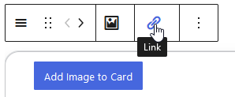
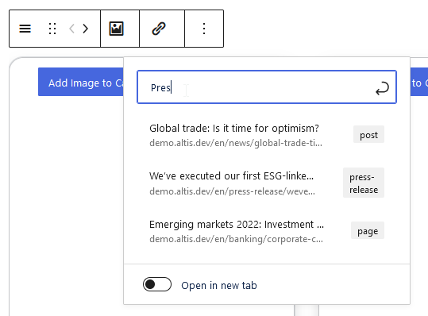

# LinkToolbar

The `LinkToolbar` component allows for linking a portion of content or other block attribute data to a user-defined URL.
Internally, `LinkToolbar` is wrapping a [`LinkControl`](https://github.com/WordPress/gutenberg/blob/trunk/packages/block-editor/src/components/link-control/index.js), and thus allows for searching posts or archives, as well as providing a custom URL.
It is also possible to mark the link to open in a new tab (where browser settings permit).





## Usage

For a minimum working setup, all you need to do is pass a URL, as well as an `onChange` callback that accepts an object with a `url` property.

```js
import { LinkToolbar } from '@humanmade/block-editor-components';
import { BlockControls } from '@wordpress/block-editor';

function BlockEdit( props ) {
	const { attributes, setAttributes } = props;
	const { url } = attributes;

	return (
		<BlockControls>
			<LinkToolbar
				url={ url }
				onChange={ ( { url } ) => setAttributes( { url } ) }
			/>
		</BlockControls>
	);
}
```

In order to support opening the resource in a new tab, the data object passed to the `onChange` callback also includes an `opensInNewTab` Boolean property.
For best UX, you should handle this as well.

```js
import { LinkToolbar } from '@humanmade/block-editor-components';
import { BlockControls } from '@wordpress/block-editor';

function BlockEdit( props ) {
	const { attributes, setAttributes } = props;
	const { opensInNewTab, url } = attributes;

	return (
		<BlockControls>
			<LinkToolbar
				opensInNewTab={ opensInNewTab }
				url={ url }
				onChange={ ( { opensInNewTab, url } ) => setAttributes( { opensInNewTab, url } ) }
			/>
		</BlockControls>
	);
}
```

## Props

The `LinkToolbar` component does not have any custom props other than `opensInNewTab`, `value` and `onChange`, which are all passed on as is to the nested [`LinkControl`](https://github.com/WordPress/gutenberg/blob/trunk/packages/block-editor/src/components/link-control/index.js) component.

### `onChange`

The callback to use for handling changing the URL (or if it should open in a new tab).
Please note that `onChange` will receive a data object, where `url` contains the URL as a string and `opensInNewTab` contains Boolean `true` or `false`, representing whether to open the URL in a new tab or not, respectively.

| Type                                 | Required                             | Default                              |
|--------------------------------------|--------------------------------------|--------------------------------------|
| `Function`                           | yes                                  | `undefined`                          |

### `opensInNewTab`

The callback to use for handling selecting and deselecting a file.
Please note that `onChange` will receive a full media object from `MediaUpload`, and `null` if a previously selected file has been deselected.

| Type                                 | Required                             | Default                              |
|--------------------------------------|--------------------------------------|--------------------------------------|
| `bool`                               | no                                   | `undefined`                          |

### `url`

The URL to link to.

| Type                                 | Required                             | Default                              |
|--------------------------------------|--------------------------------------|--------------------------------------|
| `string`                             | yes                                  | `undefined`                          |
